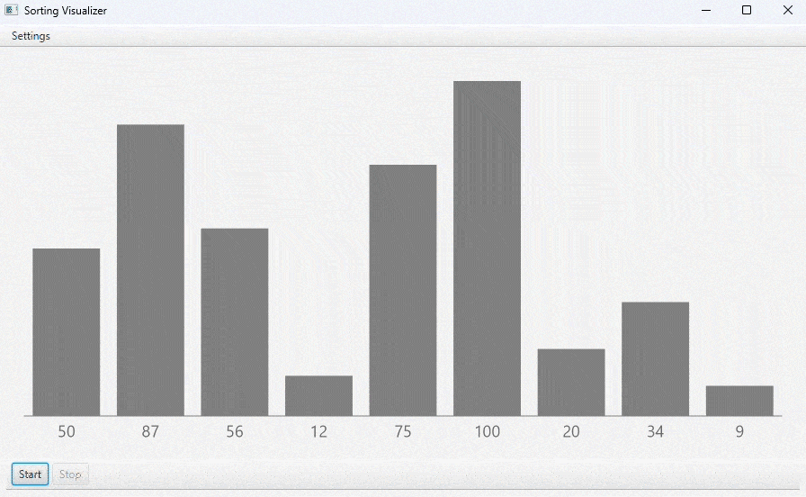

# Sorting Visualizer

A Java desktop application for visualizing sorting algorithms step by step.

## Overview

Sorting Visualizer displays integer collections as vertical bars and animates the intermediate operations performed by different sorting algorithms in real time. The user enters a list of integer values, selects a sorting algorithm, and watches the intermediate steps of the algorithm in the visual area. The implementation focuses on algorithm visualization while keeping the sorting logic extensible through a strategy-based design.

## Features

- Manual entry of integer collections through a parameter dialog.
- Visual representation of values as bars on a JavaFX canvas.
- Animated sorting updates with highlighted compared or swapped elements.
- Quick Sort visualization.
- Merge Sort visualization.
- Insertion Sort visualization.
- Speed selection for the animation.
- Strategy-style sorter abstraction for adding new algorithms with minimal UI impact.

## Tech Stack

- Java
- JavaFX
- IntelliJ IDEA project structure
- No Maven or Gradle build file is present in the repository

## Architecture

The application is organized around a small UI layer and a separate sorting layer.

- `app.Main` launches the JavaFX application and assembles the main window.
- `app.ParametersDialog` collects the input data, algorithm choice, and animation speed.
- `app.VisualizerView` hosts the canvas, start/stop controls, and rendering logic.
- `sort.Sorter` defines the shared sorting contract and the visualization update hooks.
- `sort.QuickSort`, `sort.MergeSort`, and `sort.InsertionSort` implement the concrete sorting strategies.
- `sort.UpdateCallback` is used to stream array updates back to the UI during execution.

The visualizer runs the selected sorter on a background thread. Each sorter updates the shared array through the base class helper methods, and the UI receives snapshots through the callback to redraw the bars on the JavaFX canvas.

This structure follows the Strategy pattern: the visualizer selects a sorter at runtime, while the concrete algorithm implementation stays isolated from the UI code.

## Sorting Algorithms

- Quick Sort partitions the array around a pivot and recursively sorts the two sides.
- Merge Sort recursively splits the array and merges sorted halves back together.
- Insertion Sort builds a sorted prefix by shifting larger elements to the right.

During execution, the visualizer redraws the array after comparison, swap, and write operations so the sorting process is visible step by step.

## Project Structure

```text
.
├── sorting visualizer.iml
├── src
│   ├── app
│   │   ├── Main.java
│   │   ├── ParametersDialog.java
│   │   └── VisualizerView.java
│   └── sort
│       ├── InsertionSort.java
│       ├── MergeSort.java
│       ├── QuickSort.java
│       ├── Sorter.java
│       └── UpdateCallback.java
```

## Setup and Execution

This repository is set up as a plain Java/IntelliJ project rather than a Maven or Gradle application.

To run it in IntelliJ IDEA:

1. Open the project as an existing Java project.
2. Ensure a compatible JDK is configured.
3. Configure JavaFX SDK on the module path.
4. Use the existing application run configuration or run `app.Main` directly.

The checked-in IntelliJ configuration uses these VM options:

```text
--module-path "C:\javafx-sdk-21.0.8\lib" --add-modules javafx.controls,javafx.fxml
```

The code uses JavaFX controls and canvas rendering, so a JavaFX SDK installation is required for local execution.

## Demo



## Contributions

This project was implemented independently, including the sorting algorithm visualization logic, user input workflow, and graphical representation of sorting steps.

## Future Improvements

- Add more sorting algorithms.
- Add real-time operation counters and complexity metrics.
- Add pause, resume, and step controls.
- Improve animation controls.
- Improve input validation.
- Add unit tests for the sorting strategies.